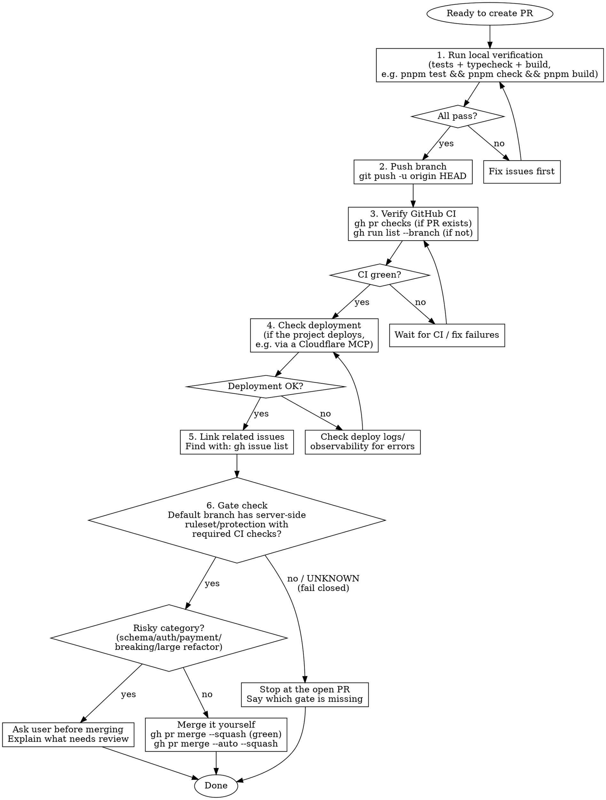

# PR Workflow

## Overview

Structured workflow for creating PRs that verifies local tests, CI status, and (where the project has one) the deployment, then merges through the repo's mechanical gate.

## When to Use

- Finishing a feature branch
- Creating a pull request
- User says "create a PR", "ship it", "merge this"

## Workflow



## Quick Reference

| Step | Command/Tool | Purpose |
|------|--------------|---------|
| Local tests | project's test/check/build commands | Verify code works |
| Push | `git push -u origin HEAD` | Push branch to remote |
| CI status | `gh pr checks` or `gh run list --branch <branch>` | Verify GitHub Actions |
| Deployment | deploy platform's CLI/MCP (if applicable) | Verify staging deploy |
| Find issues | `gh issue list` | Link related issues |
| Create PR | `gh pr create --title "..." --body "..."` | Open pull request |
| Gate check | `gh api repos/{owner}/{repo}/rules/branches/<default>` | Required checks on default branch? |
| Merge | `gh pr merge --squash` / `gh pr merge --auto --squash` | Land through the gate |

## Merge Criteria

The merge criterion is the **gate**, not the content of the change:

- **Gated** — the default branch has a server-side ruleset or branch
  protection with required CI checks: merge it yourself. Squash-merge once
  every required check is green, or enable auto-merge
  (`gh pr merge --auto --squash`) once every correctness fix is pushed.
  The merge decision is the agent's.
- **Ungated** — no required checks, or detection fails/UNKNOWN (fail
  closed): do not merge. Stop at the open PR and say which gate is missing,
  or add the gate first (free on public repos).

Gate check:

```bash
BRANCH=$(gh repo view --json defaultBranchRef --jq .defaultBranchRef.name)
gh api "repos/{owner}/{repo}/rules/branches/$BRANCH" --jq '[.[] | select(.type=="required_status_checks")]'
gh api "repos/{owner}/{repo}/branches/$BRANCH/protection" --jq '.required_status_checks'
```

**Ask-first carve-out** — even in a gated repo, ask before merging:
- Database schema changes
- Auth/security changes
- Payment/billing changes
- Breaking API changes
- Architectural decisions
- Large refactors
- Uncertainty about approach

This carve-out sits alongside the always-ask list — batched destructive
landings, production releases/deploys/tags, and changes to the guardrails
themselves — which needs a human go-ahead regardless of the gate.

## Common Mistakes

| Mistake | Fix |
|---------|-----|
| Creating PR before CI runs | Wait for `gh run list` to show completion |
| Skipping the deployment check | Verify staging works before merging (when the project deploys) |
| Not linking issues | Search with `gh issue list` and add `Closes #N` |
| Automerging risky changes | When in doubt, ask the user |
| Merging in an ungated repo | Stop at the PR; name the missing gate |
| Treating gate-detection failure as gated | UNKNOWN = ungated; fail closed |

## PR Body Template

```markdown
## Summary
- Brief description of changes

## Test plan
- [ ] Unit tests pass
- [ ] Typecheck passes
- [ ] Build succeeds
- [ ] Staging deployment verified (if applicable)

Closes #ISSUE_NUMBER
```
